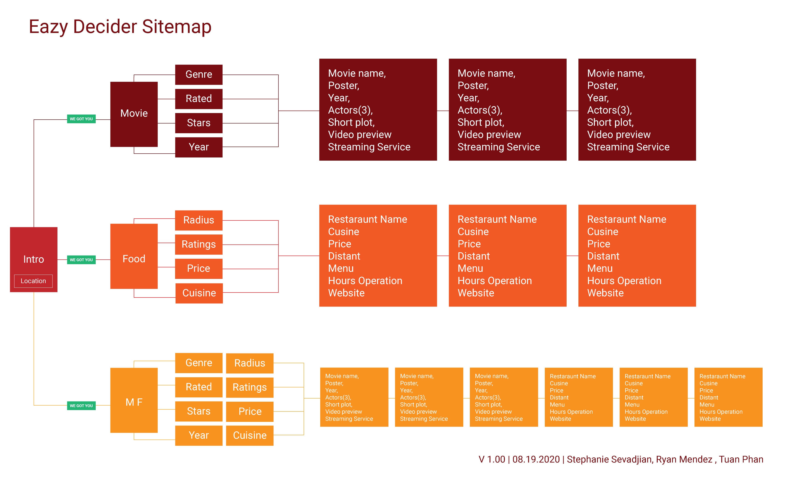

# Night In App 

Simplifying the the movie and food decision on your night in

### Team Members

- Stephanie Sevadjian 
- Ryan Mendez
- Tuan Phan

### App Functionality 

- User can get 3 random movies
- User can get 3 random movies based on genre 
- User can get 3 random restaurants by location
- User can get 3 random restaurants by location & cuisine choice

### Future Development

- Ability to rent or purchase movies directly from the app
- Add information on where the movies displayed are already streaming
- Ability to order food from the restaurants displayed directly from the app
- Add search functionality for ordering drinks to go along with your movie and meal
- Use Google Places / Maps to display on the food cards so the user can see exactly where the restaurant is located, how far away it is

### Technology Stack

- Yelp API: https://www.yelp.com/developers
- TMDB API: https://developers.themoviedb.org/3
- ZURB Foundation: https://get.foundation/ 

### Applicaiton Links

- Github: https://github.com/tuanasaurus/groupProject1DinnerMovie
- Github Pages:https://tuanasaurus.github.io/groupProject1DinnerMovie/ 
- Google SlideS Presentation:https://docs.google.com/presentation/d/1o6T32HTsrqgOKuNBl4RKtw2j3hxzNSbVF8KMcprXilA/edit?usp=sharing
- Project Docs: https://docs.google.com/document/d/1tQNaK2J5OyitXoWLKasDIxyCpT5CuAvKIwymPYmypnE/edit?usp=sharing
